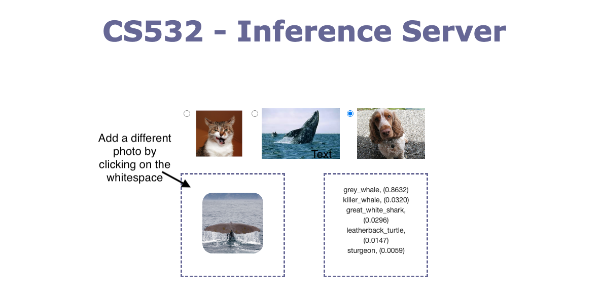

# InferenceServer
An ML inference server to serve Image classification over HTTP

# Contributors
Vishal Keshav

Kenneth Myers

Jessie Huo

# Automated script
Following script starts the docker

`sh start_docker_script.sh`

Following script does the inference on a sample image if the app is running in the docker

`sh infer_image_script.sh`

## Requirements
`docker`, `docker-compose`, `curl`

On linux machine, use the following commands (uses apt)

`sudo apt install docker`

`sudo apt install docker-compose` [Install this for one step docker setup]

`sudo apt install curl`

## How to start the app (one step app setup)
From the repository main directory,

Step1: `sudo docker-compose up`

This will start the server at 0.0.0.0:5000

For developer's, if you change anything in the source, please run `sudo docker-compose build` before `sudo docker-compose up`. This re-builds the docker with changes in the source file.

## How to query inference
Once the server is on, you can either use UI or command line interface.

### Command line interface
Use curl command to query inference on the local images.
The generic command is shown below:

`curl -X POST -F "file=@</path/image.jpeg>" http://0.0.0.0:5000/uploadajax` where </path/image.jpeg> is the image file location.

Example: If the image file "cat.jpg" is located at the root of the file system, then the command will be:

`curl -X POST -F "file=@cat.jpg" http://0.0.0.0:5000/uploadajax`

Or if the image is located in the `upload/` directory then you can use:

`curl -X POST -F "file=@upload/cat.jpg" http://0.0.0.0:5000/uploadajax`

### User interface through web browser
The app can be accessed via http://0.0.0.0:5000/ and images can be uploaded by clicking on or dragging images to the drop zone. To test a new image simply click on the whitespace around the thumbnail (see image below). There are also some example images you can use to test the classifier.

Project description: https://docs.google.com/document/d/1arkxU7LA2C-KjFfyAwzbUvSG6qoIBv9FJJze2V6TzEk/edit
